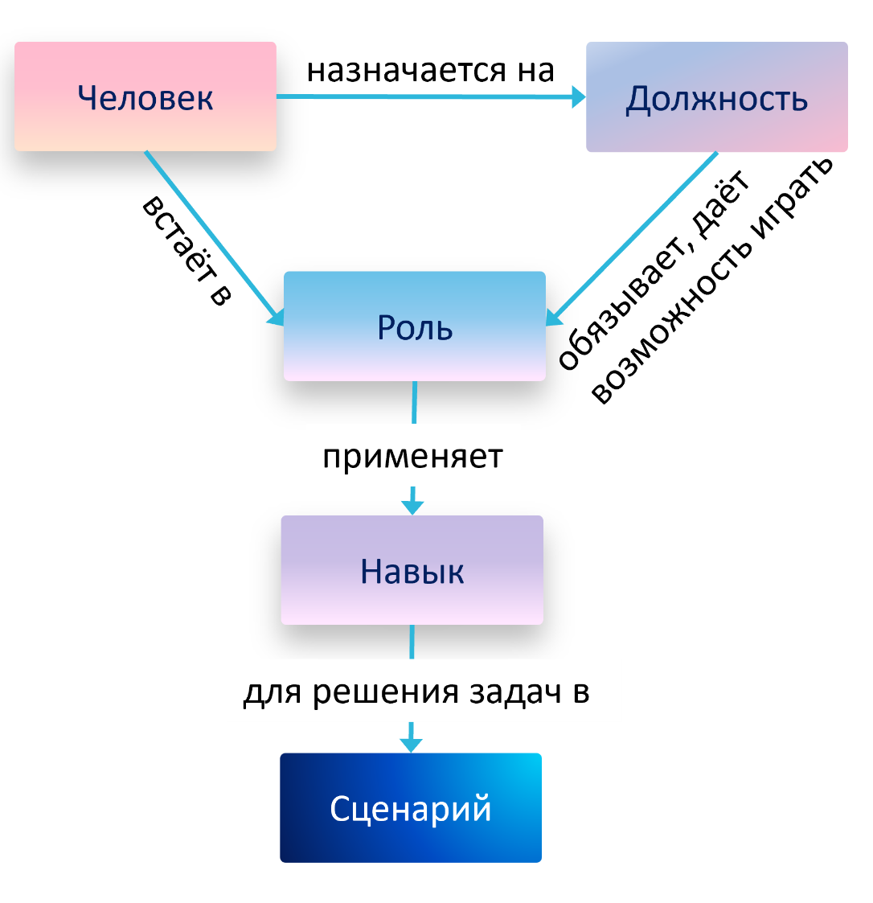

# Skills-Map

**Интерактивная карта компетенций** - проект клуба BIM-лидеров. Главная цель проекта заключается в определении конкретного набора навыков специалиста, их важности для исполнения той или иной роли в реализации различных сценариев проекта. Данная карта может применяться не только для определения компетенций сотрудников, выполняющих рабочие роли в выбранных сценариях, но и как своеобразный план профессионального развития специалистов в области BIM и прочих цифровых технологий в строительстве.

## Глоссарий:

- **Компетенция** - совокупность профессиональных знаний, навыков, умений, опыта специалиста, необходимых для выполнения определенной роли в проекте.
  
- **Навык** - это способность решать определенную задачу или выполнять действие. Навыки связаны с практическими и техническими аспектами работы.
  
- **Роль** - совокупность компетенций, обладая которыми участник бизнес-процесса может выполнять свои функции (разыгрывать сценарии).
  
- **Сценарий** - это комплекс задач проекта для достижения конкретной цели.
## Схема:

## Структура папок репозитория:
- [data](data) - машиночитаемые форматы данных по проекту
- [docs](docs) - документация, иенструкции, презентации
- [reports](reports) - отчёты, дашборды и прочие представления, подключенные к данным проекта. Предназначены для скачивания.
- [scripts](scripts) - скрипты и прочие автоматизации проекта

## Материалы проекта (быстрые ссылки):

- [Наборы таблиц](data/csv)

- [Файл с картой в формате XLSX](https://github.com/ruBLC/Skills-Map/raw/main/reports/xls/Карта%20компетенций.xlsx)

## Полезные ссылки:

- <a href="http://bimlider.ru/competency_map" target="_blank">Лендинг проекта</a>

- <a href="https://app.powerbi.com/view?r=eyJrIjoiNGUwNGY1ZTgtOGQzYS00MzVhLWIyOTQtZWNjZDgyNmRmMDNiIiwidCI6ImJlYmM0MDQ1LTkyODAtNDU5ZS1hZGZhLTdmMzMwNWMxNzNmMiIsImMiOjl9" target="_blank">Прямая ссылка на дашборд</a>
